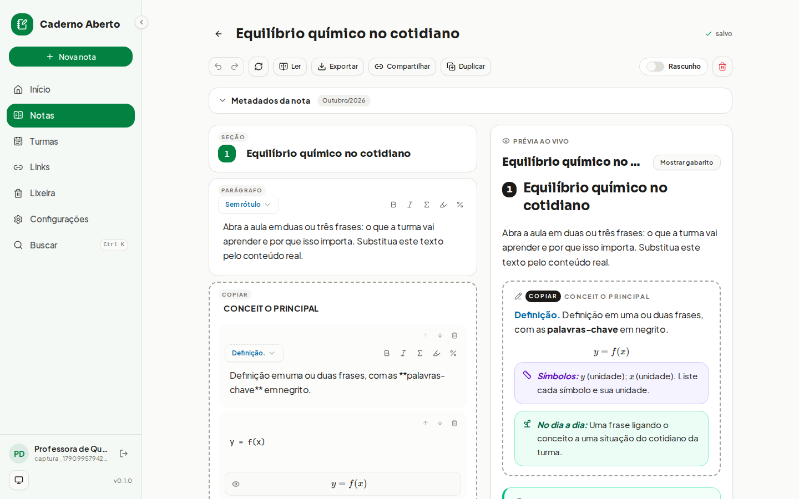
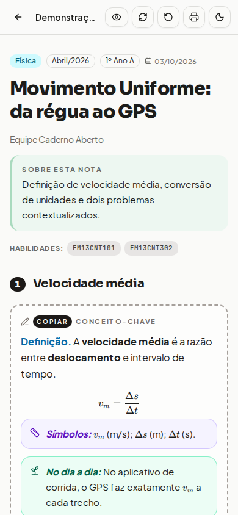
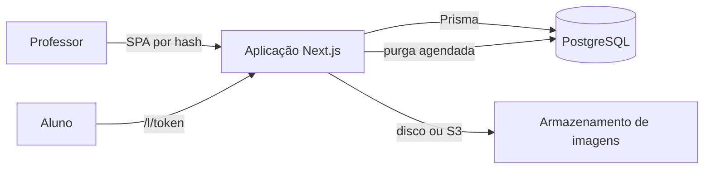

# Caderno Aberto

[](https://github.com/eemtijca/caderno-aberto/actions/workflows/qualidade.yml)
[](https://github.com/eemtijca/caderno-aberto/actions/workflows/testes.yml)
[](LICENSE)

<picture>
  <source media="(prefers-color-scheme: dark)" srcset="docs/imagens/editor-desktop-escuro.png">
  
</picture>

Plataforma web gratuita, multiusuário e mobile-first para professores do ensino médio elaborarem notas de aula de qualquer disciplina e as entregarem aos alunos por links únicos e gerenciáveis.

Aplicação publicada em https://cadernoabertojca.vercel.app, com uma página de demonstração da vista do aluno em `/l/demo-landing`.

<details>
<summary>Sumário</summary>

- [Demonstração](#demonstração)
- [Como funciona](#como-funciona)
- [Recursos](#recursos)
- [Stack](#stack)
- [Pré-requisitos](#pré-requisitos)
- [Começando](#começando)
- [Como usar](#como-usar)
- [Configuração](#configuração)
- [Arquitetura](#arquitetura)
- [Testes e qualidade](#testes-e-qualidade)
- [Deploy](#deploy)
- [Privacidade e dados](#privacidade-e-dados)
- [Segurança](#segurança)
- [Roadmap](#roadmap)
- [Perguntas frequentes](#perguntas-frequentes)
- [Documentação](#documentação)
- [Contribuindo](#contribuindo)
- [Suporte](#suporte)
- [Créditos](#créditos)
- [Licença](#licença)

</details>

## Demonstração

- Aplicação publicada: https://cadernoabertojca.vercel.app
- Vista do aluno sem login: `/l/demo-landing`, com uma nota completa de exemplo.

O editor exige uma conta de professor, criada pela administração com um código de primeiro acesso. O ambiente local cria o administrador na partida do Compose, conforme a seção [Começando](#começando).

<picture>
  <source media="(prefers-color-scheme: dark)" srcset="docs/imagens/aluno-mobile-escuro.png">
  
</picture>

## Como funciona

O professor cria uma conta, escreve no editor visual de blocos (caixas COPIAR, exemplos resolvidos, dicas, exercícios em três níveis com gabarito e fórmulas com LaTeX) e a plataforma gera, a partir da mesma fonte, os seguintes artefatos:

| Artefato              | Descrição                                                                                                                                   |
| --------------------- | ------------------------------------------------------------------------------------------------------------------------------------------- |
| Versão web responsiva | Página de leitura mobile-first com KaTeX, tema claro/escuro, gabarito ocultável e quiz interativo, entregue aos alunos por link controlável |
| PDF de impressão (A4) | Layout em duas colunas com as caixas coloridas, gerado pelo navegador (Ctrl+P) a partir da vista de leitura                                 |
| LaTeX (.tex)          | Documento autocontido (apenas pacotes padrão do Overleaf/TeX Live, sem arquivo .cls externo) que reproduz as caixas coloridas em A4         |
| Markdown (.md)        | Formato de intercâmbio legível, com importação de volta ao aplicativo (round-trip completo, incluindo aparência)                            |
| JSON (.json)          | Dados completos da nota (incluindo blocos) para backup e migração                                                                           |

## Recursos

### Organização

- Início com saudação, contadores clicáveis (notas, publicadas, disciplinas, links), notas do mês e últimas edições.
- Notas em grade de cartões com busca local, painel de filtros por disciplina, ano letivo, mês e turma (com chips ativas), contagem de resultados e paginação.
- Organização por ano letivo, com acordeão por turma (agrupado por mês), cartões por disciplina e grupo de notas sem turma.
- Busca global (`Ctrl/Cmd+K`) com debounce, mínimo de 2 caracteres e tolerância a acentos, exibindo campo de origem e trecho contextual.

### Editor de blocos

- 12 tipos de bloco: seção numerada, parágrafo, fórmula em destaque, lista, tabela, chamada, figura, diagrama TikZ, COPIAR, exemplo, dica e exercícios.
- Caixas COPIAR, exemplo e dica com blocos filhos (parágrafo, fórmula, lista, tabela e chamada).
- Exercícios em 3 níveis renomeáveis (padrão Conceitos, Aplicação e Síntese), com questões abertas ou de múltipla escolha (até 5 alternativas), marcação da correta e gabarito manual ou automático.
- Parágrafo com rótulos fixos (Definição, Fórmulas, Relações, Modelo básico e Resolução) ou rótulo livre; chamada em 3 estilos (Atenção, No dia a dia e Símbolos e unidades).
- Tabela com linhas e colunas editáveis e primeira linha opcional como cabeçalho; figura por upload com compressão ou URL, com legenda.
- Barra de formato inline (negrito, itálico, fórmula `$...$`, destaque `\resultado{...}` e química `$\ce{...}$`) e prévia KaTeX ao vivo.
- Reordenação por arrastar e soltar (mouse e teclado), botões de mover, duplicar e excluir, paleta de inserção contextual e desfazer/refazer estrutural com `Ctrl+Z` e `Ctrl+Shift+Z`.
- Seleção múltipla em Notas, Links e Lixeira, com ações em lote no servidor: publicar, voltar a rascunho, definir disciplina e mover para a lixeira; pausar, reativar e excluir links; restaurar itens da lixeira.
- Botão de atualizar em todas as telas com dados e atualização automática ao entrar quando os dados estiverem velhos.
- Salvamento automático com indicador de estado; título editável na barra; ações de ler, exportar, compartilhar, duplicar (a cópia abre como rascunho), alternar rascunho e publicada, e excluir com confirmação.
- Metadados por nota: disciplina, ano letivo, mês, turmas, resumo "Sobre" e habilidades BNCC/ENEM.
- Aparência por nota: 5 fontes, 4 tamanhos e 3 entrelinhas, aplicadas ao professor, ao aluno e à impressão.
- Diálogo Nova nota com título (mínimo de 2 caracteres), disciplina (seleção ou criação inline com cor e ícone), ano, mês, turmas opcionais e interruptor "Começar do modelo", que cria uma aula guiada e neutra, com orientações de preenchimento em cada bloco.

### Exportação e impressão

- No editor: arquivo para impressão (`.tex`), arquivo de texto (`.md`) e backup da nota (`.json`), todos nomeados pelo slug da nota.
- Na leitura, para professor e aluno: botão Imprimir/PDF com layout A4 em duas colunas, cabeçalho próprio com disciplina, período, turmas, professor, resumo e habilidades, sem páginas em branco ao final; alternativas do quiz impressas como texto.

### Links únicos para os alunos

- Compartilhamento de uma nota (somente publicadas), de uma turma inteira ou de uma disciplina completa, com nome opcional; a criação já copia o endereço.
- Gestão por cartão ou pelo diálogo rápido, sem sair da leitura: copiar, abrir como aluno, renomear, definir expiração, pausar e reativar, regenerar o endereço (invalida o anterior) e excluir com confirmação.
- Contador de acessos por link e aviso quando a nota-alvo ainda é rascunho.
- Endereço em caminho real (`/l/<token>`): WhatsApp, Telegram e redes sociais exibem prévia com imagem, título e descrição gerados por nota (OpenGraph). Links antigos em `/#/l/<token>` continuam funcionando.
- Rascunhos nunca ficam visíveis; links pausados, expirados ou revogados exibem a mensagem "Link indisponível".

### Configurações

- Hub com seções em telas próprias: Perfil, Segurança, Disciplinas, Turmas, Dados e Exclusão.
- Perfil com nome e escola (exibidos nas notas e na impressão) e e-mail.
- Segurança com troca de senha (mínimo de 8 caracteres, com confirmação e senha atual); o e-mail da conta só é alterado pela administração.
- Disciplinas com nome, cor e ícone gráfico (menu suspenso), contador de notas e renomeação; excluir preserva as notas (apenas desvincula).
- Turmas com nome, série e ano letivo, agrupadas por ano; excluir preserva as notas.
- Dados com backup completo em um único arquivo JSON (disciplinas, turmas, notas, links e imagens em base64) e restauração substitutiva com dry-run, confirmação por digitação e snapshot para rollback. A importação de uma nota única (`.md` ou `.json`) fica na tela Notas.
- Lixeira com retenção de 30 dias para notas e links, com restauração e desfazer imediato.
- Exclusão de conta em 2 etapas (aceite, palavra EXCLUIR e senha) com carência de 24 horas; a solicitação encerra a sessão e bloqueia o acesso. Para recuperar, o professor entra de novo e confirma em uma tela de recuperação; a conta de administração não pode ser excluída.

### Administração

- Desativar (reversível, com motivo e senha) e excluir contas, com proteção do último administrador e da conta de bootstrap.
- Aprovação em duas etapas (quatro olhos) opcional para ações destrutivas.
- Telas de erro e aviso padronizadas (404, 500, sessão expirada, sem permissão, link indisponível, conta desativada) e aviso de conexão offline.

### Vista do aluno (sem login)

- Acesso por link único `/l/<token>`; coleções de turma e disciplina sempre abrem a lista de aulas com busca local, e a aula só é exibida quando escolhida.
- Leitura com disciplina, mês e ano, turmas, professor, caixa "Sobre" e chips de habilidades; fórmulas, diagramas, tabelas, figuras e caixas coloridas.
- Quiz de múltipla escolha com correção instantânea, botão de mostrar e ocultar gabarito, impressão em PDF e alternador de tema.
- Herança da fonte, do tamanho e da entrelinha definidos pelo professor; faixa de aviso quando o link expira em menos de 3 dias; página de demonstração em `/l/demo-landing`.

### Acesso e conta de professor

- Página inicial é a tela de login (aplicação de uma escola, sem landing page).
- Primeiro acesso e recuperação de senha por código de 8 caracteres gerado pela administração; o professor solicita o código, a administração entrega e o professor define a senha.
- Console de administração com fila de solicitações, emissão e revogação de códigos, gestão de contas e auditoria dos eventos sensíveis, com filtro por ação, paginação e limpeza da trilha mediante senha e confirmação.
- Temas claro, escuro e sistema; aplicativo somente em português; navegação por rotas hash (`#/`, `#/notas`, `#/organizacao`, `#/links`, `#/lixeira`, `#/configuracoes` com as seções de perfil, segurança, disciplinas, turmas, dados e exclusão, `#/recuperacao`, `#/admin`, `#/editor/:id`, `#/nota/:id`, `#/l/:token`, `#/entrar`, `#/codigo`, `#/solicitar`) com retorno ao início em rota desconhecida.
- Layout responsivo com barra lateral recolhível no desktop e navegação inferior no celular; notificações toast em todas as ações, com mensagens de erro em português.
- Estados de carregamento independentes por elemento (esqueletos por cartão, filtro, número e seção) e animações sutis, inclusive nos painéis expansíveis, que respeitam `prefers-reduced-motion`.

## Stack

- Next.js 16 (App Router) com TypeScript e Node 24.
- PostgreSQL 15 ou superior com Prisma ORM v7 (`prisma/schema.prisma`, migrações em `prisma/migrations/`).
- Conexões separadas no Supabase e em ambientes serverless: `DATABASE_URL` (runtime, pooler de transação `:6543`) e `DIRECT_URL` (CLI e migrações, pooler de sessão ou conexão direta `:5432`); local e CI usam apenas `DATABASE_URL`.
- Autenticação própria (scrypt e JWT em cookies HttpOnly); acesso por código de 8 caracteres gerado pela administração, sem dependência de e-mail.
- Imagens atrás de interface agnóstica: disco local (`disk`, volume Docker) ou API compatível com S3 (`s3`: MinIO, R2 ou similar).
- Tailwind CSS 4 com shadcn/ui, KaTeX com mhchem, dnd-kit (editor) e TanStack Query.

Paleta: verde institucional `#008241`.

## Pré-requisitos

- Node 24.
- Docker com Compose no modo recomendado.
- PostgreSQL 15 ou superior próprio, como alternativa ao Compose.

## Começando

Com Docker Compose:

```bash
cp .env.example .env
# Gere os segredos: openssl rand -base64 32 (cole em AUTH_SECRET e CRON_SECRET no .env)
docker compose up --build
```

O Compose sobe o PostgreSQL 17 (`db:5432`, volume `pgdata`), aplica as migrações na partida e inicia o aplicativo em http://localhost:3000. Com `STORAGE_DRIVER=disk` (padrão), as imagens ficam no volume `uploads`. Defina `ADMIN_EMAIL`, `ADMIN_SENHA` e `ADMIN_NOME` no `.env` para criar o administrador na partida, ou rode `npm run criar-admin` depois.

Instruções sem Docker e demais variáveis: [docs/ambiente.md](docs/ambiente.md). Publicação: [docs/deploy.md](docs/deploy.md).

## Como usar

1. A administração cria a conta do professor e entrega o código de 8 caracteres do primeiro acesso.
2. O professor define a senha, abre o editor e escreve a nota de aula em blocos.
3. Ao terminar, publica a nota e compartilha com a turma, a disciplina ou a nota inteira, gerando um link único.
4. O aluno abre o link sem login, lê a aula, responde ao quiz e pode imprimir em PDF.
5. A administração acompanha as solicitações de código, as contas e a auditoria no console.

## Configuração

As variáveis são validadas com Zod na partida. As principais:

| Variável                                   | Papel                                                                |
| ------------------------------------------ | -------------------------------------------------------------------- |
| `DATABASE_URL`                             | Conexão de runtime, com pooler de transação em ambientes serverless. |
| `DIRECT_URL`                               | Conexão de sessão para CLI e migrações em banco gerenciado.          |
| `AUTH_SECRET`                              | Segredo da sessão e dos códigos de acesso.                           |
| `CRON_SECRET`                              | Segredo do agendador da purga e das rotas de manutenção.             |
| `STORAGE_DRIVER`                           | Armazenamento de imagens: `disk` ou `s3`.                            |
| `ADMIN_EMAIL`, `ADMIN_SENHA`, `ADMIN_NOME` | Administrador inicial criado na partida do Compose.                  |

A referência completa está em [docs/ambiente.md](docs/ambiente.md).

## Arquitetura

Aplicação Next.js única, com o editor e as telas do professor em uma SPA por hash e rotas reais apenas para a página pública e a API.



As camadas, o fluxo de uma requisição autenticada e as decisões registradas estão em [docs/arquitetura.md](docs/arquitetura.md) e [docs/adr/](docs/adr/).

## Testes e qualidade

| Comando                    | Efeito                                                |
| -------------------------- | ----------------------------------------------------- |
| `npm run format:check`     | Prettier em modo verificação.                         |
| `npm run lint`             | ESLint com regras do Next e ajustes do projeto.       |
| `npm run tsc`              | Verificação de tipos sem emissão.                     |
| `npm run test:unit`        | Bibliotecas puras e guarda editorial.                 |
| `npm run test:api`         | Isolamento por RLS com o papel `app_teste`.           |
| `npm run test:contratos`   | Contratos HTTP com o aplicativo no ar.                |
| `npm run test:destrutivas` | Lixeira, step-up e dry-run do backup.                 |
| `npm run test:e2e:docker`  | Playwright na imagem oficial, com o aplicativo no ar. |
| `npm run capturas:readme`  | Regenera as capturas do README em `docs/imagens/`.    |

A convenção das suítes está em [docs/testes.md](docs/testes.md) e [tests/README.md](tests/README.md).

## Deploy

> [!NOTE]
> A implantação na Vercel está pausada; a publicação de imagem no GHCR segue ativa, por dispatch manual. O passo a passo de reativação está em [docs/portabilidade.md](docs/portabilidade.md).

[](https://vercel.com/new/clone?repository-url=https%3A%2F%2Fgithub.com%2Feemtijca%2Fcaderno-aberto&project-name=caderno-aberto&repository-name=caderno-aberto&env=DATABASE_URL,DIRECT_URL,AUTH_SECRET,CRON_SECRET,ADMIN_EMAIL,ADMIN_SENHA,ADMIN_NOME,STORAGE_DRIVER&envDescription=Vari%C3%A1veis%20do%20Caderno%20Aberto%3A%20banco%2C%20segredos%2C%20administrador%20inicial%20e%20armazenamento&envLink=https%3A%2F%2Fgithub.com%2Feemtijca%2Fcaderno-aberto%2Fblob%2Fmain%2Fdocs%2Fambiente.md)

Na Vercel, o disco é efêmero: use `STORAGE_DRIVER=s3` com um bucket compatível. O build não aplica migrações; depois do primeiro deploy, rode `npm run db:deploy` apontando para o banco de produção. As demais formas de publicação e o agendador estão em [docs/deploy.md](docs/deploy.md).

## Privacidade e dados

Cada professor acessa apenas os próprios dados, com filtro pelo dono no servidor e políticas de RLS como segunda barreira. As imagens ficam no armazenamento configurado, o backup completo é exportável em JSON e a exclusão de conta tem carência de 24 horas. O repositório não contém dados reais; a massa de testes usa o domínio `@exemplo.br`. Detalhes em [docs/seguranca.md](docs/seguranca.md).

## Segurança

Vulnerabilidades são reportadas em issue privada ou security advisory, nunca em issue pública. A sessão combina JWT curto com refresh rotativo revogável, o CSRF é bloqueado no proxy e o CSP usa nonce por requisição. Controles e lacunas conhecidas em [docs/seguranca.md](docs/seguranca.md) e a política de reporte em [SECURITY.md](SECURITY.md).

## Roadmap

As próximas mudanças são discutidas nas [issues do repositório](https://github.com/eemtijca/caderno-aberto/issues) e registradas no [CHANGELOG.md](CHANGELOG.md).

## Perguntas frequentes

**O Caderno Aberto é gratuito?**
Sim, e de código aberto sob licença MIT. Cada professor cria a própria conta sem custo.

**Meus dados ficam isolados dos outros professores?**
Sim. Toda consulta é filtrada pelo professor dono no servidor, com políticas de segunda barreira no banco e suíte de isolamento automatizada.

**Como levo minhas notas para outro lugar?**
Baixe o backup completo em Configurações, seção Dados (JSON com notas, links e imagens) ou exporte cada nota em `.md`, `.json` ou `.tex`. A restauração substitui os dados atuais.

**Excluí minha conta. E agora?**
Dentro de 24 horas, entre novamente com suas credenciais e escolha Restaurar conta na tela de recuperação. Se preferir seguir com a exclusão, basta sair. Depois do prazo, a purga remove tudo permanentemente.

**Funciona sem internet ou como aplicativo de celular?**
Não. O Caderno Aberto é uma aplicação web responsiva, em português, que exige conexão; não há modo offline nem aplicativo nativo.

**Como consigo uma conta?**
A conta é criada pela administração da escola, que entrega um código de primeiro acesso. Não há cadastro público.

## Documentação

| Documento                                          | Conteúdo                                              |
| -------------------------------------------------- | ----------------------------------------------------- |
| [docs/README.md](docs/README.md)                   | Índice de toda a documentação                         |
| [docs/arquitetura.md](docs/arquitetura.md)         | Camadas, fluxo de requisição e organização do código  |
| [docs/ambiente.md](docs/ambiente.md)               | Variáveis de ambiente e execução local                |
| [docs/banco.md](docs/banco.md)                     | Esquema, migrações, RLS e rotinas de banco            |
| [docs/api.md](docs/api.md)                         | Referência das rotas HTTP                             |
| [docs/modelo-de-dados.md](docs/modelo-de-dados.md) | Entidades, relações e glossário do domínio            |
| [docs/editor.md](docs/editor.md)                   | Tipos de bloco, formatação inline e aparência         |
| [docs/interface.md](docs/interface.md)             | Design system, temas, responsividade e acessibilidade |
| [docs/operacao.md](docs/operacao.md)               | Runbooks, backup, purga e resolução de problemas      |
| [docs/testes.md](docs/testes.md)                   | Suítes de teste, convenções e CI                      |
| [docs/seguranca.md](docs/seguranca.md)             | Controles de segurança e modelo de ameaça             |
| [docs/deploy.md](docs/deploy.md)                   | Vercel, Compose, migrações e agendador                |
| [CONTRIBUTING.md](CONTRIBUTING.md)                 | Rotina de desenvolvimento e convenções                |
| [CODE_OF_CONDUCT.md](CODE_OF_CONDUCT.md)           | Normas de convivência da comunidade                   |
| [SECURITY.md](SECURITY.md)                         | Política de reporte de vulnerabilidades               |
| [CHANGELOG.md](CHANGELOG.md)                       | Histórico de mudanças do projeto                      |

Decisões de arquitetura ficam em [docs/adr/](docs/adr/).

## Contribuindo

Leia o [CONTRIBUTING.md](CONTRIBUTING.md) antes de propor mudanças. Issues e pull requests usam etiquetas de tipo e de área, commits atômicos em um único pull request e abertura somente com o trabalho finalizado. Agentes de IA seguem o [AGENTS.md](AGENTS.md).

## Suporte

Dúvidas e problemas são bem-vindos nas [issues do repositório](https://github.com/eemtijca/caderno-aberto/issues). Para vulnerabilidades, use o canal privado descrito no [SECURITY.md](SECURITY.md).

## Créditos

Projeto mantido pela equipe do Caderno Aberto na EEMTI José Cláudio de Araújo.

## Licença

Veja o arquivo [LICENSE](./LICENSE).
