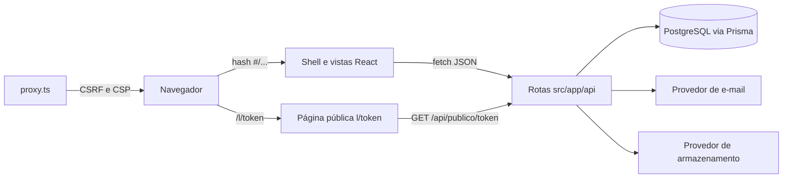
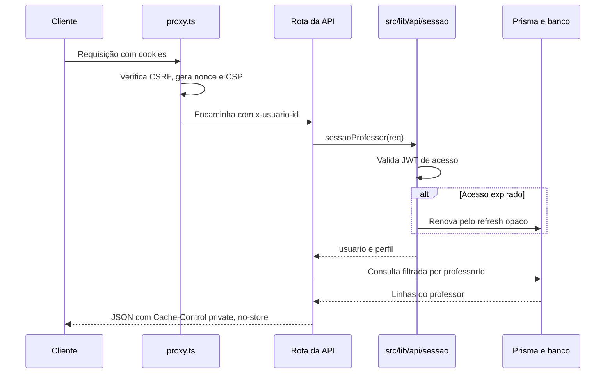

# Arquitetura

Next.js 16 (App Router) com TypeScript sobre PostgreSQL 15 ou superior via Prisma Client v7. A aplicação é um único processo Node que serve páginas e rotas de API, além de um cliente React que opera como aplicação de página única por rotas hash.

## Visão geral

O navegador carrega `src/app/page.tsx`, que monta um shell de navegação e escolhe a vista correspondente ao hash da URL. As ações chamam rotas em `src/app/api/**`, que resolvem a sessão, filtram os dados pelo professor dono e respondem JSON. A página pública de uma nota é renderizada no caminho real `/l/[token]`, que produz metadados OpenGraph e redireciona para a vista de aluno.



## Camadas

- `src/app/api/`: rotas HTTP. Cada rota resolve a sessão com `sessaoProfessor`, filtra pelo dono no banco e responde com `json` ou `erroApi`. Todas usam `dynamic = "force-dynamic"`, exceto `GET /api`.
- `src/app/`: páginas. Apenas `src/app/page.tsx` (shell com rotas hash) e `src/app/l/[token]` (página pública com metadados e OpenGraph).
- `src/components/`: interface. O editor, as vistas de domínio, os diálogos e os componentes de `ui/` (shadcn).
- `src/hooks/`: `use-sessao` (ciclo de autenticação e carência) e utilitários de interface.
- `src/proxy.ts`: middleware que aplica CSRF, CSP com nonce e cabeçalhos de segurança, além de propagar o identificador do usuário.
- `src/lib/auth/`: hash de senha (scrypt), sessões (JWT de acesso e refresh opaco com rotação) e validação de entrada.
- `src/lib/api/`: helpers de sessão, serialização, token de link, limite de tentativas e resolução de links públicos.
- `src/lib/banco.ts`: singleton do PrismaClient (`banco()`); `src/lib/banco/tipos.ts` espelha o schema para o servidor.
- `src/lib/armazenamento/`: interface única de imagens (`disk` local ou `s3` compatível com S3). O caminho relativo é a chave.
- `src/lib/email/`: interface única de envio (`log`, `smtp` ou `resend`), com outbox em memória disponível apenas em testes.
- `src/lib/notas/`: AST de blocos, geração de LaTeX e Markdown, busca textual, ícones e cores.
- `src/lib/ambiente.ts`: validação das variáveis de ambiente com zod, com falha antecipada.

## Fluxo de uma requisição autenticada



O JWT de acesso tem validade de 1 hora e é verificado sem consultar o banco. O refresh opaco tem validade de 30 dias, é armazenado apenas como hash e sofre rotação a cada renovação, com trava de concorrência para que apenas uma renovação vença. Detalhes em [seguranca.md](seguranca.md).

## Isolamento entre professores

Toda consulta carrega `professorId` ou `usuario.id` na cláusula `where` do banco. As políticas RLS (`app.usuario_atual`) funcionam como segunda barreira e são provadas em `tests/api/isolamento.test.ts`; o isolamento efetivo da API é coberto em `tests/api/contratos.test.ts`. A aplicação nunca define `app.usuario_atual` e conecta com o dono do schema, portanto o filtro da API é a camada que isola os dados em produção. Ver [banco.md](banco.md) e [ADR-003](adr/003-isolamento.md).

## Renderização e formatos

Os blocos da nota vivem em um AST (`src/lib/notas/tipos.ts`) armazenado como JSON no banco. A partir do mesmo AST, a aplicação produz:

- a vista web (`src/components/notas/**`), com KaTeX e TikZJax;
- o Markdown de intercâmbio (`render-markdown.ts`), com round-trip pela rota de importação;
- o LaTeX autocontido (`render-latex.ts` e `latex.ts`);
- o JSON completo da nota para backup e migração.

Detalhes de edição em [editor.md](editor.md) e do modelo em [modelo-de-dados.md](modelo-de-dados.md).

## Organização de diretórios

```
src/
  app/
    api/              rotas HTTP (multiusuário, sessão por cookies)
      auth/           cadastro, login, verificação, recuperação e troca
      publico/[token] vista do aluno (sem login) e servidor de imagens
    l/[token]/        página pública com metadados e OpenGraph
    page.tsx          shell do aplicativo em rotas hash
  components/         editor, vistas, diálogos, shell e ui/ (shadcn)
  hooks/              sessão e utilitários de interface
  lib/
    api/              sessão, serialização, links públicos e limite
    armazenamento/    imagens atrás de interface única (disk, s3)
    auth/             scrypt, sessões e validação
    email/            provedor agnóstico (log, smtp, resend) e modelos
    notas/            AST, LaTeX, Markdown, busca, paleta e ícones
    ambiente.ts       validação de variáveis
    banco.ts          singleton do PrismaClient
  proxy.ts            CSRF, CSP e sessão no limite
prisma/               schema, migrations e scripts de RLS local
docker/               entrypoint, migrador e reposição local
docs/                 esta documentação
tests/                Vitest (unit, isolamento e contratos)
e2e/                  Playwright headless
```

## Decisões registradas

- [ADR-001: Prisma Client v7](adr/001-prisma-v7.md)
- [ADR-002: provedores agnósticos de e-mail e imagens](adr/002-provedores-agnosticos.md)
- [ADR-003: isolamento pelo dono com RLS de barreira](adr/003-isolamento.md)
