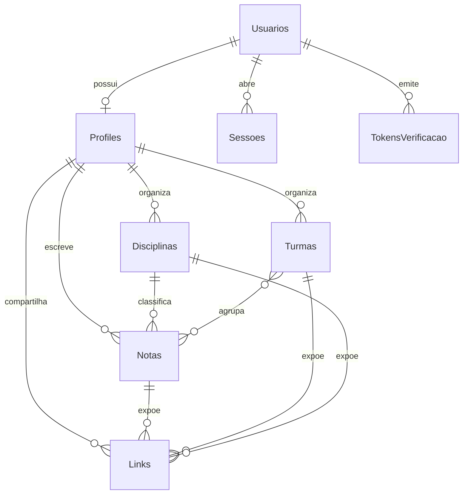

# Modelo de dados

Descrição das entidades persistidas e do vocabulário do domínio. O schema é a fonte da verdade em `prisma/schema.prisma`; este documento explica a intenção de cada tabela e campo.

## Entidades

### Usuarios

Credenciais e verificação de e-mail.

| Campo               | Tipo        | Observação                              |
| ------------------- | ----------- | --------------------------------------- |
| `id`                | uuid        | Chave primária                          |
| `email`             | text        | Único na prática, validado na aplicação |
| `senhaHash`         | text        | Formato `scrypt$N$r$p$salHex$chaveHex`  |
| `emailVerificadoEm` | timestamptz | Nulo enquanto não confirmado            |
| `criadoEm`          | timestamptz | Criação                                 |
| `atualizadoEm`      | timestamptz | Última alteração                        |

### Profiles

Perfil do professor. Usa o mesmo `id` de `Usuarios`.

| Campo                      | Tipo        | Observação                                   |
| -------------------------- | ----------- | -------------------------------------------- |
| `id`                       | uuid        | Chave primária e estrangeira para `Usuarios` |
| `nome`                     | text        | Exibido nas notas e na impressão             |
| `email`                    | text        | Espelho do e-mail                            |
| `escola`                   | text        | Exibida no perfil                            |
| `preferencias`             | jsonb       | Preferências de interface                    |
| `exclusaoSolicitadaEm`     | timestamptz | Início da carência de exclusão               |
| `expiraEm`                 | timestamptz | Fim da carência, base para a purga           |
| `criadoEm`, `atualizadoEm` | timestamptz | Auditoria                                    |

### Disciplinas

| Campo                      | Tipo        | Observação                       |
| -------------------------- | ----------- | -------------------------------- |
| `id`                       | uuid        | Chave primária                   |
| `professorId`              | uuid        | Dono                             |
| `nome`                     | text        | Único por professor              |
| `cor`                      | text        | Chave da paleta, padrão `verde`  |
| `icone`                    | text        | Nome do ícone, padrão `BookOpen` |
| `ordem`                    | int         | Ordenação manual                 |
| `criadoEm`, `atualizadoEm` | timestamptz | Auditoria                        |

### Turmas

| Campo                      | Tipo        | Observação                       |
| -------------------------- | ----------- | -------------------------------- |
| `id`                       | uuid        | Chave primária                   |
| `professorId`              | uuid        | Dono                             |
| `nome`                     | text        | Único por professor e ano letivo |
| `serie`                    | text        | Padrão `Outro`                   |
| `anoLetivo`                | int         | Ano                              |
| `criadoEm`, `atualizadoEm` | timestamptz | Auditoria                        |

### Notas

Nota de aula. Guarda blocos e aparência como JSON e cópias denormalizadas para leitura rápida.

| Campo                      | Tipo        | Observação                             |
| -------------------------- | ----------- | -------------------------------------- |
| `id`                       | uuid        | Chave primária                         |
| `professorId`              | uuid        | Dono                                   |
| `titulo`                   | text        | Padrão `Sem título`                    |
| `disciplinaId`             | uuid        | Pode ser nulo; usa `onDelete: SetNull` |
| `disciplinaNome`           | text        | Cópia denormalizada                    |
| `disciplinaCor`            | text        | Cópia denormalizada                    |
| `turmasIds`                | text[]      | Identificadores das turmas             |
| `turmasNomes`              | text[]      | Cópia denormalizada                    |
| `anoLetivo`                | int         | Ano                                    |
| `mes`                      | int         | Mês (1 a 12)                           |
| `sobre`                    | text        | Resumo de abertura                     |
| `habilidades`              | text        | Habilidades BNCC/ENEM                  |
| `status`                   | text        | `rascunho` ou `publicada`              |
| `blocos`                   | jsonb       | AST de blocos                          |
| `aparencia`                | jsonb       | Fonte, escala e entrelinha             |
| `busca`                    | text        | Texto normalizado usado na busca       |
| `criadoEm`, `atualizadoEm` | timestamptz | Auditoria                              |

### Links

Vínculo público de leitura, com token, expiração e contador.

| Campo                               | Tipo        | Observação                               |
| ----------------------------------- | ----------- | ---------------------------------------- |
| `id`                                | uuid        | Chave primária                           |
| `professorId`                       | uuid        | Dono                                     |
| `tipo`                              | text        | `nota`, `turma` ou `disciplina`          |
| `notaId`, `turmaId`, `disciplinaId` | uuid        | Apenas o alvo do tipo é preenchido       |
| `token`                             | text        | Único, 128 bits                          |
| `professorNome`                     | text        | Cópia denormalizada do nome do professor |
| `nome`                              | text        | Rótulo opcional                          |
| `ativo`                             | boolean     | Padrão `true`                            |
| `pausadoNaExclusao`                 | boolean     | Marca links pausados pela carência       |
| `expiraEm`                          | timestamptz | Nulo significa sem expiração             |
| `acessos`                           | int         | Contador de acessos                      |
| `criadoEm`                          | timestamptz | Criação                                  |

### Sessoes

Sessões de refresh. O token é armazenado apenas como hash SHA-256.

| Campo                     | Tipo        | Observação          |
| ------------------------- | ----------- | ------------------- |
| `id`                      | uuid        | Chave primária      |
| `usuarioId`               | uuid        | Usuário             |
| `tokenHash`               | text        | Único               |
| `ip`                      | text        | Origem              |
| `agente`                  | text        | User-agent truncado |
| `expiraEm`                | timestamptz | Validade de 30 dias |
| `criadoEm`, `ultimoUsoEm` | timestamptz | Auditoria           |

### TokensVerificacao

Tokens de verificação de e-mail, recuperação e troca de e-mail.

| Campo       | Tipo        | Observação                                     |
| ----------- | ----------- | ---------------------------------------------- |
| `id`        | uuid        | Chave primária                                 |
| `usuarioId` | uuid        | Usuário                                        |
| `tipo`      | text        | `verificacao`, `recuperacao` ou `troca_email`  |
| `tokenHash` | text        | Único                                          |
| `novoEmail` | text        | Preenchido no tipo `troca_email`               |
| `expiraEm`  | timestamptz | 24 horas na verificação, 1 hora na recuperação |
| `usadoEm`   | timestamptz | Nulo enquanto não consumido                    |
| `criadoEm`  | timestamptz | Criação                                        |

### TentativasLimite

Contador de limite de tentativas por chave `rota:ip`, com chave primária composta `(chave, feitaEm)`.

## Glossário

| Termo                    | Definição                                                                                                             |
| ------------------------ | --------------------------------------------------------------------------------------------------------------------- |
| Ano letivo               | Ano ao qual a turma e a nota pertencem                                                                                |
| Aparência                | Conjunto de fonte, escala e entrelinha de uma nota, aplicado na leitura e na impressão                                |
| Backup                   | Arquivo JSON com disciplinas, turmas, notas, links e imagens em base64                                                |
| Bloco                    | Unidade do AST de uma nota (seção, parágrafo, fórmula, lista, tabela, chamada, figura, diagrama, caixa ou exercícios) |
| Caixa                    | Bloco com filhos: COPIAR, exemplo resolvido ou dica                                                                   |
| Carência                 | Prazo de 24 horas entre o pedido de exclusão e a purga, durante o qual a conta pode ser restaurada                    |
| Disciplina               | Classificação da nota, com nome, cor e ícone                                                                          |
| Gabarito                 | Respostas corretas, automáticas para múltipla escolha e livres para questões abertas                                  |
| Link público             | Endereço `/l/<token>` que dá acesso de leitura a uma nota, turma ou disciplina publicada                              |
| Nota                     | Nota de aula, composta de metadados e blocos                                                                          |
| Purga                    | Remoção definitiva de contas com carência vencida                                                                     |
| Restauração substitutiva | Restauração de backup que apaga os dados atuais do professor antes de recriar os do arquivo                           |
| Rótulo                   | Marcador de parágrafo (Definição, Fórmulas, Relações, Modelo básico, Resolução ou livre)                              |
| Round-trip               | Capacidade de exportar uma nota para um formato e importá-la de volta sem perda relevante                             |
| Rascunho                 | Nota não publicada, invisível em links públicos                                                                       |
| Slug                     | Identificador legível derivado do título, usado nos nomes de arquivo de exportação                                    |
| Token de link            | Credencial aleatória de 128 bits que identifica um link público                                                       |
| Turma                    | Agrupamento de alunos por nome, série e ano letivo                                                                    |
